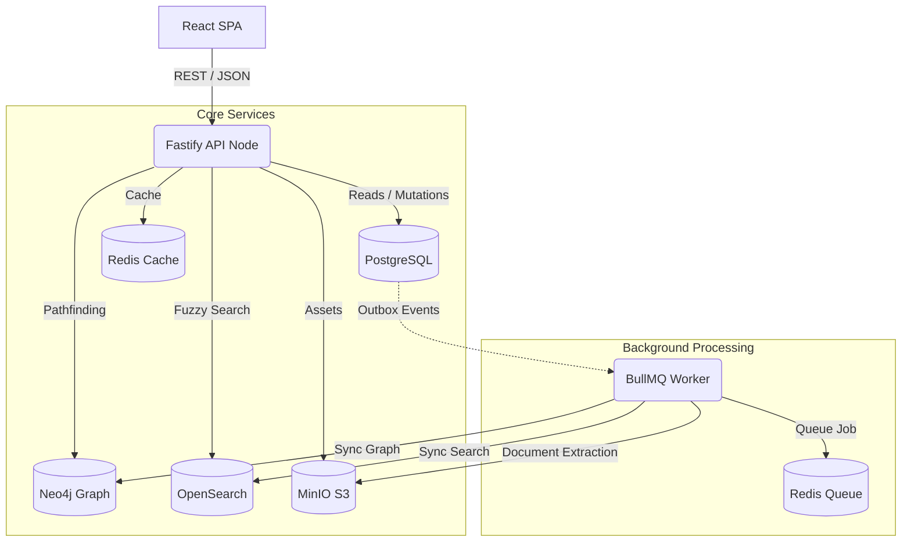

# GraphSphere

GraphSphere is an enterprise-grade knowledge discovery and relationship exploration platform. It ingests organizational data, skills, projects, and documents to build an interconnected graph of expertise, powering high-fidelity semantic search and expert discovery workflows.

## Features

- **Expert Discovery**: Find engineers and domain experts based on their graph proximity to projects, skills, and documents.
- **Full-Text Semantic Search**: Distributed searching across all entity types.
- **Document Ingestion**: Scalable background processing for document knowledge extraction.
- **Rich Visualization**: Interactive graph exploration.
- **Enterprise Ready**: Full RBAC, rate limiting, and observability.

## Architecture Stack

GraphSphere utilizes a microservices-inspired monorepo architecture:
- **Web**: React (Vite) + Vanilla CSS (Glassmorphism Dark Theme)
- **API**: Fastify + Node.js
- **Worker**: BullMQ + Node.js
- **Primary Database**: PostgreSQL (via Prisma ORM)
- **Knowledge Graph**: Neo4j
- **Search Engine**: OpenSearch
- **Object Storage**: MinIO (S3 Compatible)
- **Caching & Queues**: Redis

### System Architecture Flow



## Getting Started

### Prerequisites
- Node.js >= 20.x
- Docker & Docker Compose (for running infrastructure)

### Setup

1. **Install Dependencies**
   ```bash
   npm install
   ```

2. **Start Infrastructure**
   ```bash
   docker compose up -d
   ```

3. **Initialize Database**
   ```bash
   npm run seed -w @graphsphere/api
   ```

4. **Start Application**
   ```bash
   npm run dev
   ```

This will concurrently start the API on port 4000, the Web frontend on port 5173, and the background worker.

## Workspace Structure
- `apps/web`: The React frontend application.
- `apps/api`: The core REST API handling auth, crud, and search/graph routing.
- `apps/worker`: Background service for asynchronous event processing.
- `packages/shared`: Shared TypeScript types, schemas, and utilities.

## Operational Excellence

The system is designed with production readiness in mind:
- **Metrics**: Exposes Prometheus metrics at `/metrics`.
- **Security**: Utilizes `@fastify/helmet` for headers and `@fastify/rate-limit` for DDoS protection.
- **Validation**: Strict schema validation on all boundaries using `zod`.
- **Type Safety**: 100% end-to-end TypeScript compilation.
