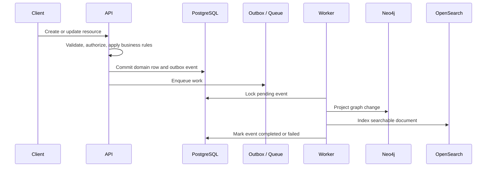

# Architecture

## Component Responsibilities

| Component | Responsibility |
| --- | --- |
| React web app | Authenticated workflows for browsing, search, graph traversal, and document handling |
| Fastify API | Auth, RBAC, validation, REST resources, orchestration, metrics, and request logging |
| Worker | Outbox processing, document text extraction, projection updates, retries, and failure marking |
| PostgreSQL | Authoritative transactional data and durable outbox events |
| Neo4j | Rebuildable graph projection for traversal |
| OpenSearch | Rebuildable entity and document search index |
| Redis | Short-lived cache entries and queue coordination |
| Object storage | Document bytes |

## Data Ownership

PostgreSQL is the only source of truth for entities, relationships, document metadata, users, roles, and outbox state. Neo4j and OpenSearch are projections. Redis is disposable optimization. Object storage owns document bytes, with PostgreSQL owning metadata and storage keys.

## Write Flow

## Graph Model

Nodes:

- `Employee`
- `Project`
- `Skill`
- `Team`
- `Department`
- `Organization`
- `Document`

Relationships:

- `Employee -[:HAS_SKILL]-> Skill`
- `Employee -[:WORKED_ON]-> Project`
- `Employee -[:MEMBER_OF]-> Team`
- `Team -[:BELONGS_TO]-> Department`
- `Department -[:BELONGS_TO]-> Organization`
- `Project -[:BELONGS_TO]-> Organization`
- `Document -[:RELATED_TO]-> Entity`

Relationship properties include timestamps plus role, dates, source, and confidence where useful.

The implemented traversal query finds employees with a role, a matching project domain, and a collaborator on that project who has a requested skill.

## Search

OpenSearch indexes entities and document text with fields for:

- `entityType`
- `organizationId`
- `title`
- `subtitle`
- `body`
- `tags`
- `status`
- `updatedAt`

The API supports keyword search, type filtering, pagination, relevance ordering, title ordering, and update-time ordering.

## Caching

Cache scope is intentionally narrow:

- Expensive graph query results use `graph:*` keys.
- TTL is short to reduce stale relationship exposure.
- Relationship-changing writes invalidate graph prefixes.
- Redis failure degrades to direct computation.

## Security

- JWT bearer tokens.
- Bcrypt password hashing.
- RBAC roles: `ADMIN`, `EDITOR`, `VIEWER`.
- Organization-level access control.
- Request validation at every write boundary.
- CORS, secure headers, and rate limits.
- Redacted logs.
- Safe environment template.

## Observability

- Request IDs.
- Structured application logs.
- Prometheus metrics endpoint.
- Liveness and readiness endpoints.
- Request latency histogram.
- Cache operation counters.
- Worker outcome counters.

## Fault Tolerance

| Failure | Behavior |
| --- | --- |
| PostgreSQL unavailable | Writes and readiness fail fast |
| Neo4j unavailable | Graph queries degrade; transactional writes continue with outbox backlog |
| OpenSearch unavailable | Search degrades; writes continue with indexing backlog |
| Redis unavailable | Cache is skipped; core reads and writes continue where possible |
| Object storage unavailable | Document upload fails clearly |
| Worker failure | Events remain pending or failed with retry metadata |

## Scalability

- API is stateless and horizontally scalable.
- Workers scale independently from API.
- PostgreSQL uses indexes and connection pooling.
- Graph traversal uses explicit query shapes and graph indexes.
- Search uses bulk indexing and index aliases for rebuilds.
- Document ingestion is asynchronous.
- Pagination and bounded page sizes are enforced.

## Trade-Offs

- A modular monorepo keeps the assignment reviewable while preserving runtime separation.
- Derived graph/search stores create eventual consistency, but avoid overloading the relational system.
- Focused graph query APIs are safer than arbitrary query execution.
- The local demo store keeps tests and review startup simple; production ownership is represented by schema, adapters, and deployment configuration.
