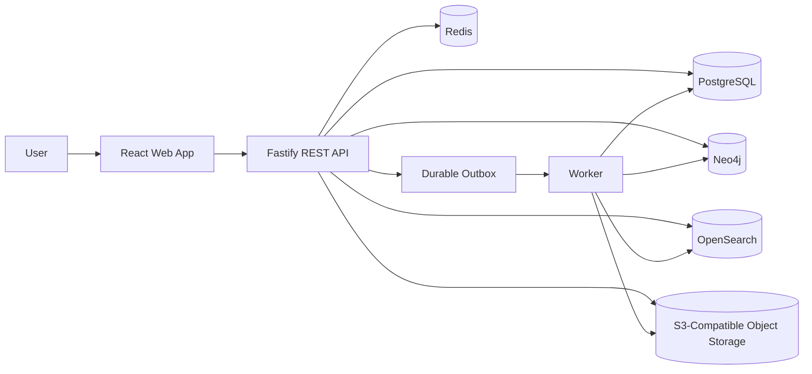

# Submission Summary

## Page 1 - Architecture

Core flow:

- PostgreSQL owns users, organizations, employees, skills, projects, documents, relationships, and outbox events.
- Neo4j owns graph traversal projections.
- OpenSearch owns searchable indexes.
- Redis owns short-lived cache and queue coordination.
- Object storage owns document bytes.
- API remains stateless; worker scales separately.

## Page 2 - Architecture Decisions

- Modular monorepo instead of microservices: clear boundaries with low operational overhead.
- PostgreSQL as source of truth: transactions, relational integrity, migrations, and indexes.
- Neo4j as graph projection: efficient multi-hop traversal for collaboration and skill paths.
- OpenSearch for search: relevance, filters, pagination, sorting, and document retrieval.
- REST APIs: predictable resource model, validation, pagination, HTTP status codes, and error structure.
- Auth and RBAC: JWT bearer tokens, bcrypt password hashing, `ADMIN`, `EDITOR`, and `VIEWER` roles.
- Cache policy: only expensive graph queries and stable metadata, short TTLs, invalidate on relationship writes.
- Document pipeline: upload, object storage, metadata, outbox event, worker processing, indexing, status updates.

## Page 3 - Production Engineering

- Scalability: stateless API nodes, independently scaled workers, connection pooling, pagination, bulk indexing.
- Latency: CRUD target under 200 ms, simple search under 500 ms, focused graph traversal under 750 ms at small production scale.
- Indexing: PostgreSQL entity/relationship indexes, Neo4j uniqueness and traversal indexes, OpenSearch typed mappings.
- Fault tolerance: derived stores can lag without corrupting PostgreSQL; failed document jobs retain status and retry metadata.
- Observability: request IDs, structured logs, `/metrics`, `/health/live`, `/health/ready`, cache counters, worker outcome counters.
- Security: environment secrets, secure headers, CORS, rate limits, validation, RBAC, organization scope, redacted logs.
- Trade-offs: derived projections add eventual consistency; focused graph endpoints limit flexibility but improve security and performance.
- Future work: stronger tenant isolation, richer document extraction, tracing, projection reconciliation tools, and query DSL.
